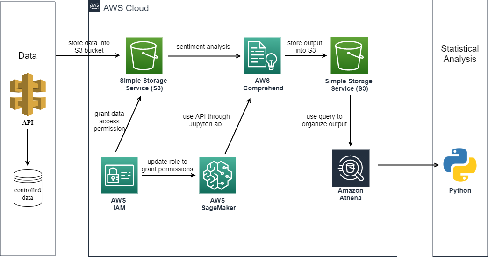
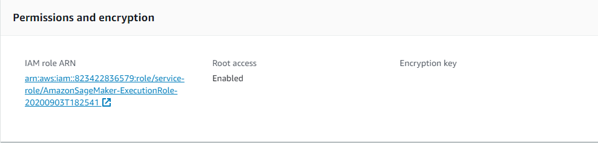
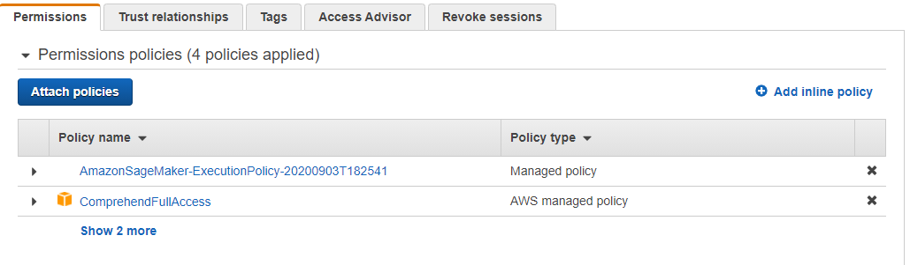
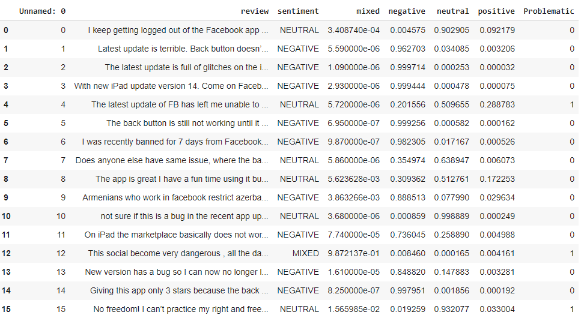
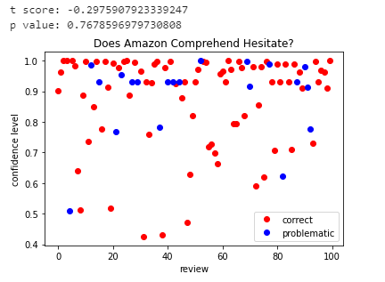
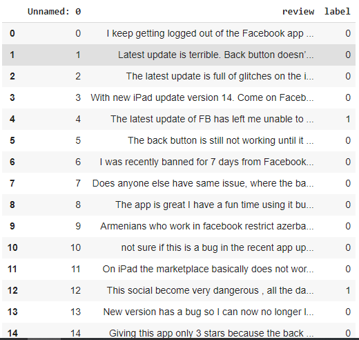
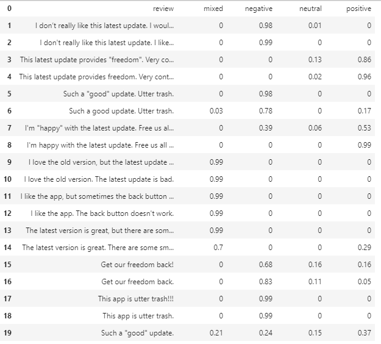
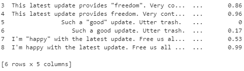
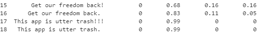

# Evaluating Amazon Machine Learning Service -- Amazon Comprehend Using Facebook App Reviews

## Overview
Every business experiences the process of digging through reviews for products and extracting useful takeaways from these. Reviews are often hastily written, and emotionally charged, prone to grammatical errors and misuse of punctuation. In some instances, reviews can be very confusing. A product can have a very high rating, for example, “4.8/5 stars”, while simultaneously receiving a multitude of negative reviews from the reviewees. Our work aims to explore the relationship between ratings and the sentiment of reviews using the Natural Language Processing Service Amazon Comprehend. In this post, we show you how you can use Amazon Comprehend sentiment analysis to extract useful meaning from reviews. We explore how different word choice, sentence structure, and punctuation affect the sentiment score in the hopes of further understanding the different variables that affect the score. We start with an overview of Amazon Comprehend, then discuss the specific function that we are concerned with, discuss the effect that word choice, sentence structure, and punctuation have on the sentiment score, and then how our findings can be utilized to interpret product reviews.

## Architecture Overview


This project retrieves data from Facebook APP Reviews API and generates controlled data for analysis. The data is stored into AWS S3 bucket and is further fed into Amazon Comprehend (ML service) for sentiment analysis. In the process, the notebook instance in JupyterLab in AWS SageMaker is used. To grant Amazon Comprehend data access permission from S3 and to grant SageMaker permission to perform analysis using API, AWS IAM is used. The sentiment result is stored back into S3 bucket. To organize the output into dataframe, Amazon Athena is used to query the result. Finally, the project utilizes python for statistical analysis. 

## Retrieving API Data
### Getting API and Access Token
**42matters** provides App Reviews API for Apple App Store iOS Apps. We can get information such as dates, ratings of the app, and review contents. From [here](https://42matters.com/docs/app-market-data/ios/apps/reviews), you can sign up for free and get an access token on a 14-day trial. 


#### API key and `getpass`
Below, we are using a python package called getpass. On the first line of the code cell below, `import getpass` will load all of the functions that are available in the getpass package into memory on our notebook's machine. 

Then, we use the function `getpass()` by referring to where it is located with `getpass.getpass()` and storing the output of that function in a variable we are calling `APIKEY`.

```
import getpass
APIKEY = getpass.getpass()
```

### Saving and filtering the results of a API call
The output is in json format, but it is really hard to read. Let's save it to another file. Then we will use another tool to filter the json file down to the information we are interested in.
#### Saving output
To save the output, we add another argument to the curl command, `-o`, and then after it, we write a name for the file.

```
!curl --request GET -o facebook-app-review01.json "https://data.42matters.com/api/v2.0/ios/apps/reviews.json?id=284882215&access_token=$APIKEY&days=30&limit=100&lang=en"
```

### Viewing and filtering the JSON with `jq`
[`jq`](https://stedolan.github.io/jq/)is a command line tool for  slicing, filtering, transforming JSON data. 

First we install it with the cell below.

```
!sudo yum install jq
!jq < facebook-app-review01.json
```

### Filtering using `jq`
To filter based on key, use `jq '.key'`, where `.key` is one of the keys from the JSON file, and `jq` will return the corresponding values in the JSON. For example, we filter on the key `reviews` in the cell below for Facebook App Reviews.

```
!jq '.reviews' < facebook-app-review01.json
```

Let's dig deeper and look at the values for the key `content`. Since it is within the values of the key `reviews`, we will use  `.reviews[].content` to filter out the review contents. 

```
!jq 'reviews[].content ' < facebook-app-review01.json  >facebook-app-review1.json
```

### From JSON to csv
For working with structured data in notebooks, the most popular and full-featured packages is `pandas`.  It can tranform our JSON into a csv file.

First we import the pandas package.

```
import pandas as pd
```

Then, we use the `read_json()` function in pandas to transform our filtered JSON into a *dataframe*.

```
pd.read_json('facebook-app-review1.json', orient='records')
```

Let's save the dataframe as a Python variable, which we will call `df1`, so that we can use it for more purposes than just viewing.

```
df1=pd.read_json('facebook-app-review1.json', orient='records')
df1=df1[['review']]
```

A dataframe consists of a *header*, where you find the names of the *columns*, *rows* where you find the values in those columns, and an *index* where you can find the row number. So this includes the information you find in a csv. Indeed, we can write this to a .csv file with the following pandas function.

```
df1.to_csv('facebook-app-review1.csv')
```

# Store Data into S3

### Set up an IAM Role
In order to use this API within Sagemaker, we will need to update the Role we have been using to control Sagemaker permissions.

#### Where can I find that role?
Go to your Sagemaker dashboard, then notebook instances, then click the notebook instance name to access the page for the "Notebook instance settings". You should then see the page below.




There, under the heading "Permissions and encryption" click the link to the IAM role ARN. You should then see a view similar to this one below.


 

#### Adding policies
As we work with new AWS services within our notebooks, it will be necessary to add policies which give Sagemaker access to them. To use the examples we will present for working with Amazon Comprehend, you will need to add `ComprehendFullAccess` permissions.

To add them, in the IAM role Summary page (pictured in the last screenshot), click the blue "Attach policies" button. In the search bar, type the names of these services that were just listed, select them by ticking the empty white box next to the name when it appears, and then click the blue "Attach policy" button. 

`AdministratorAccess` also needs to be added for creating IAM Role for Amazon Comprehend later on.

### Getting started using the console
Before using the Comprehend service programatically, it will be helpful to understand what it does by walking through examples in the AWS console [here](https://console.aws.amazon.com/comprehend/home?region=us-east-1#home).

### Working with the Comprehend API programatically
In this section, you use the Amazon Comprehend API operations to analyze text.

### Set up the AWS CLI
In any new Sagemaker instance, the AWS CLI (Command Line Interface) comes preinstalled. Indeed, to check that this is the case, run the command below.

```
!aws s3 help
```

Next, let's create a S3 bucket called `sentiment-review-facebook`.

```
!aws s3 mb s3://sentiment-review-facebook
```

To ensure that your bucket was created successfully, run the following command.

```
!aws s3 ls
```

### Upload Input Data
By adding the path /input/ at the end, Amazon S3 automatically creates a new folder called input in your bucket and uploads the dataset file to that folder.

```
!aws s3 cp facebook-app-review1.csv s3://sentiment-review-facebook/input/
```

To ensure that your file was uploaded successfully, run the following command. The command lists the contents of your bucket's `input` folder.

```
!aws s3 ls sentiment-review-facebook/input/
```

# Creating IAM Role for Amazon Comprehend
### To Create IAM Role

Save the following trust policy as a JSON document called `comprehend-trust-policy.json` in a code or text editor. This trust policy declares Amazon Comprehend as a trusted entity and allows it to assume an IAM role.

```
{
  "Version": "2012-10-17",  
  "Statement": [      
    {    
      "Effect": "Allow",      
      "Principal": {      
        "Service": "comprehend.amazonaws.com"        
      },      
      "Action": "sts:AssumeRole"      
    }
  ]  
}
```

To create the IAM role, run the following AWS CLI command. The command creates an IAM role called comprehend-access-role and attaches the trust policy to the role.

```
!aws iam create-role --role-name comprehend-access-role --assume-role-policy-document file:///home/ec2-user/SageMaker/comprehend-trust-policy.json
```

Copy the Amazon Resource Name (ARN) and save it in a text editor. You need this ARN to run Amazon Comprehend analysis jobs.

### To Create IAM Policy

Save the following policy locally as a JSON document called `comprehend-access-policy.json`. It grants Amazon Comprehend access to the specified S3 bucket.

{ 

    "Version": "2012-10-17",
    "Statement": [
        {
            "Action": [
                "s3:GetObject"
            ],
            "Resource": [
                "arn:aws:s3:::DOC-EXAMPLE-BUCKET/*"
            ],
            "Effect": "Allow"
        },
        {
            "Action": [
                "s3:ListBucket"
            ],
            "Resource": [
                "arn:aws:s3:::DOC-EXAMPLE-BUCKET"
            ],
            "Effect": "Allow"
        },
        {
            "Action": [
                "s3:PutObject"
            ],
            "Resource": [
                "arn:aws:s3:::DOC-EXAMPLE-BUCKET/*"
            ],
            "Effect": "Allow"
        }
    ]
}

To create the S3 bucket access policy, run the following AWS CLI command.

```
!aws iam create-policy --policy-name comprehend-access-policy1 --policy-document file:///home/ec2-user/SageMaker/comprehend-access-policy.json
```

Copy the access policy ARN and save it in a text editor.
You need this ARN to attach your access policy to your IAM role.

### To Attach IAM Policy IAM Role

```
!aws iam attach-role-policy --policy-arn arn:aws:iam::823422836579:policy/comprehend-access-policy1 --role-name comprehend-access-role
```

You now have an IAM role called `comprehend-access-role` that has a trust policy for Amazon Comprehend and an access policy that grants Amazon Comprehend access to your S3 bucket. 

# Running AWS Comprehend Analysis

```
!aws comprehend start-sentiment-detection-job --input-data-config S3Uri=s3://sentiment-review-facebook/input/ --output-data-config S3Uri=s3://sentiment-review-facebook/output/ --data-access-role-arn arn:aws:iam::823422836579:role/comprehend-access-role --job-name reviews-sentiment-analysis --language-code en --region us-east-1 
```

After you submit the job, copy the `JobId` and save it to a text editor. You will need the JobId to find the output files from the analysis job.

```
!aws comprehend describe-sentiment-detection-job --job-id c3c37495ed423dc20eabae704a151ab9
```

# Preparing the Output
### Download Output Files

In the OutputDataConfig object, find the `S3Uri` value. And download the sentiment output archive to your local directory.

```
!aws s3 cp s3://sentiment-review-facebook/output/823422836579-SENTIMENT-c3c37495ed423dc20eabae704a151ab9/output/output.tar.gz /home/ec2-user/SageMaker/sentiment-output.tar.gz
```

### Extract Output Files

```
!tar -xvf sentiment-output.tar.gz --transform 's,^,sentiment-,'
```

### Upload Output Files to S3

```
!aws s3 cp /home/ec2-user/SageMaker/sentiment-output s3://sentiment-review-facebook/sentiment-results/
```

### To load the data into an AWS Glue Data Catalog

To create an IAM role for AWS Glue, save the following trust policy as a JSON document called `glue-trust-policy.json`.
```
{
  "Version": "2012-10-17",
  "Statement": [  
    {
      "Effect": "Allow",
      "Principal": {
        "Service": "glue.amazonaws.com"
      },
      "Action": "sts:AssumeRole"
    }    
  ]  
}
```

```
!aws iam create-role --role-name glue-access-role --assume-role-policy-document file:///home/ec2-user/SageMaker/glue-trust-policy.json
```

Save Amazon Resource Number (ARN) for the new role.

Save the following IAM policy as a JSON document called `glue-access-policy.json`. The policy grants AWS Glue permission to crawl your results folders.

```
{
    "Version": "2012-10-17",
    "Statement": [
        {
            "Effect": "Allow",
            "Action": [
                "s3:GetObject",
                "s3:PutObject"
            ],
            "Resource": [
                "arn:aws:s3:::DOC-EXAMPLE-BUCKET/sentiment-results*"
            ]
        }
    ]
}
```

```
!aws iam create-policy --policy-name glue-access-policy --policy-document file:///home/ec2-user/SageMaker/glue-access-policy.json
```

Save ARN again and attach the new policy to the IAM role.

```
!aws iam attach-role-policy --policy-arn arn:aws:iam::823422836579:policy/glue-access-policy --role-name glue-access-role
```

Attach the AWS managed policy AWSGlueServiceRole to your IAM role by running the following command.

```
!aws iam attach-role-policy --policy-arn arn:aws:iam::aws:policy/service-role/AWSGlueServiceRole --role-name glue-access-role
```

Create an AWS Glue database by running the following command.

```
!aws glue create-database --database-input Name="comprehend-results"
```

Create a new AWS Glue crawler.

```
!aws glue create-crawler --name comprehend-analysis-crawler --role arn:aws:iam::823422836579:role/glue-access-role  --targets S3Targets=[{Path="s3://sentiment-review-facebook/sentiment-results"}] --database-name comprehend-results
```

Start the crawler.

```
!aws glue start-crawler --name comprehend-analysis-crawler
```

### Prepare the Data for Analysis

Now you have a database populated with the Amazon Comprehend results. However, the results are nested. To unnest them, you run a few SQL statements in Amazon Athena. Amazon Athena is an interactive query service that makes it easy to analyze data in Amazon S3 using standard SQL. Athena is serverless, so there is no infrastructure to manage and it has a pay-per-query pricing model. In this step, you create new tables of cleaned data that you can use for analysis and visualization. You use the Athena console to prepare the data.

Open the [Athena console](https://console.aws.amazon.com/athena/).

In the navigation bar, choose Settings.

For Query result location, enter s3://DOC-EXAMPLE-BUCKET/query-results/. This creates a new folder called query-results in your bucket that stores the output of the Amazon Athena queries you run. Choose Save.

In the navigation bar, choose Query editor.

For Database, choose the AWS Glue database `comprehend-results` that you created.

In the Tables section, you should have one table called sentiment_results. Preview the table to make sure that the crawler loaded the data. In table’s options, choose Preview table. A short query runs automatically. Check the Results pane to ensure that the table contain data.

To unnest the `sentiment_results table`, enter the following query in the **Query editor** and choose **Run query**.

```
CREATE TABLE sentiment_results_final AS

SELECT file, line, sentiment,

sentimentscore.mixed AS mixed,

sentimentscore.negative AS negative,

sentimentscore.neutral AS neutral,

sentimentscore.positive AS positive

FROM sentiment_results
```

After obtaining the results from Athena, download the csv file.

```
df1=pd.read_csv('facebook-app-review1.csv')
df2=pd.read_csv('sentiment-output-final.csv')
df1.columns =['line', 'rating', 'review'] 
final_dataset=pd.merge(df1, df2)
final_dataset=final_dataset[['review', 'sentiment', 'mixed', 'negative', 'neutral', 'positive']]
final_dataset.to_csv('final_dataset1.csv')
```


## Evaluate the performance of Amazon Comprehend
After looking at the data sample closely, we identify 17 clear misinterpretations of the sentiment. Most of the misinterpretation involves the unclarity between neutral and negative. For example, in one comment, the person states that: “No freedom! I can’t practice my right and freedom to express my ideas. They always remove my comments and freeze my account. No freedom anymore. Very controlling!” In this case, the comment seems extremely negative, but Amazon Comprehend identifies this statement as neutral with a confidence level of 0.93. To evaluate these misinterpretation, we created a new csv file `final_dataset2.csv`, adding one column to the original dataset, labeling correct outcome with 0 and incorrect outcome with 1. 



```
import statistics
import pandas as pd
import matplotlib.pyplot as plt
from scipy import stats

myfile = pd.read_csv('final_dataset2.csv')
num_0 = list()
num_1 =list()
confidence_level_0 = list()
confidence_level_1 = list()
```

### Plotting the outcomes.
Then we plot the confidnece levels with two colors to look at them clearly.

```
for i in range (myfile.shape[0]):
    if myfile.iloc[i][7] == 0:
        num_0.append(i)
        confidence_level_0.append( max(myfile.iloc[i][3],myfile.iloc[i][4],myfile.iloc[i][5],myfile.iloc[i][6]))
    else:
        num_1.append(i)
        confidence_level_1.append( max(myfile.iloc[i][3],myfile.iloc[i][4],myfile.iloc[i][5],myfile.iloc[i][6]))

plt.plot(num_0,confidence_level_0,'ro',label="correct")
plt.plot(num_1,confidence_level_1,'bo',label = "problematic")
plt.title("Does Amazon Comprehend Hesitate?")
plt.xlabel("review")
plt.ylabel("confidence level")
plt.legend(loc='lower right')
```


We notice that there are no significant difference between the two groups of outcome, which means that Amazon Comprehend is still confident enough, even when it commit a false interpretation. To testify this observation, we further conduct a T-test.

## Conducting a T-test between misinterpretations and the sample data.

```
mean_0 = statistics.mean(confidence_level_0)
mean_1 = statistics.mean(confidence_level_1)

t_score, p_value = stats.ttest_ind(confidence_level_0,confidence_level_1, equal_var = False)
print("t score:", t_score)
print("p value:", p_value)

plt.show()
```

We get t score: -0.2975907923339247 and p value: 0.7678596979730808

The outcome shows that our observation is correct. Most of the time, Amazon Comprehend is confident even though it has a wrong interpretation.

### What causes these misinterpretations?
First, we create a column marking those wrong interpretations as 1 and the others as 0. Then we build a dictionary that corresponds to the number of comments that each word appears in. By identifying all the words that appear in at least 10 comments in our dataset, we gather the 15 words that contribute the most to the failure of Amazon Comprehend and the 15 words that could best free the sentiment analyze from errors.

Here we extract 2 columns from `final_dataset2.csv` into `final_dataset3.csv` to perform the analysis. 



```
import argparse
import numpy as np
import pandas as pd
import nltk
nltk.download('punkt')
from nltk.stem import PorterStemmer

def model_assessment(filename):
    stemming = PorterStemmer()
    myfile = pd.read_csv('final_dataset3.csv')
    my_data = myfile["review"]
    rows = myfile.shape[0]
    num_reviews = rows
    data = list()
    r = ["I", "and", "to", "a" , ",", "." , "of" , "is" , "the","it", "you"]
    for i in range (num_reviews):
        word = list(nltk.word_tokenize(my_data[i])) ## split the comments into words

        for k in r:
            if k in word:
                word.remove(k)

        data.append([stemming.stem(w) for w in word]) ## delete stems such as "ing" and "ed"

    data = np.array(data)
    y = myfile["label"]

    xFeat = data

    return xFeat, y ## we get the further cleaned dataset consists of all the words in their stem form


def build_vocab_map(mydata): ## In this function, we identify all the words that appeared at least ten times in our dataset
    num_comment = len(mydata)
    vocab_all = {} ## vocab map for all the words
    vocab_10 = {} ## vocab map for words frequency bigger than 10
    vocab_boolean = {}  ## check if the word updated for this comment

    for i in range(num_comment):
        txt = mydata[i]
        for j in txt:
            if j not in vocab_all.keys(): ## if the word never appeared, update directly
                vocab_all.update({j : 1})

            else:
                if j not in vocab_boolean.keys(): ## if the word appear in the current comment for the first time
                    vocab_boolean.update({j:True}) ## set the boolean true

                if vocab_boolean[j] is True: ## if it's the first time appeared in this comment
                    vocab_all.update({j: vocab_all[j]+1}) ## update in the map

                    if vocab_all[j] > 10:
                        vocab_10.update({j: vocab_all[j]})

                    vocab_boolean.update({j: False}) ## set the boolean false to indicate it already updated

        vocab_boolean.clear() ## clean the boolean dictionary as finishing one comment

    return vocab_10 


def construct_binary(mydata,vocab_map): ## For each comment, we transform it into a feature vector, with 1 and 0.
    lines = len(mydata)
    binary_data = list()
    for i in range(lines):
        txt = mydata[i]
        comment_dict = {}
        comment_binary = list()
        for word in txt:
            comment_dict.update({word:0})
        for key in vocab_map:
            if key in comment_dict.keys():
                comment_binary.append(1)
            else:
                comment_binary.append(0)
        binary_data.append(comment_binary)

    return binary_data 
```

Then we transfer text data into numerical data to enable the computer to calculate.

```
def main():
    """
    Main file to run from the command line.
    """
    # set up the program to take in arguments from the command line
    
    xFeat, y = model_assessment("final_dataset1.csv")
    vocab_map = build_vocab_map(xFeat)
    binary = construct_binary(xFeat, vocab_map)


    y = pd.DataFrame(y, columns=['label'])

    y.to_csv("y.csv", index=False)

    binary = pd.DataFrame(binary)
    binary.columns = list(vocab_map.keys())
    binary.to_csv("binary.csv", index=False)


if __name__ == "__main__":
    main()
```

Here we obtain two csv files (binary.csv and y.csv). With these files, we could further calculate the weight of each word on contributing to the correctness of sentiment analyze.

```
class Perceptron(object):
    mEpoch = 1000  # maximum epoch size
    w = None       # weights of the perceptron

    def __init__(self, epoch):
        self.mEpoch = epoch

    def train(self, xFeat, y):
        trainStats = {}
        rows, cols = xFeat.shape
        self.w = np.zeros(cols+1)

        for epoch in range(self.mEpoch):
            mistake = 0
            for row, label in zip(xFeat, y):
                prediction = np.dot(self.w[1:], row) + self.w[0]
                if prediction >= 0:
                    prediction = 1
                else:
                    prediction = 0
                self.w[1:] += (label - prediction) * row
                self.w[0] += label - prediction
                if prediction != label:
                    mistake =  mistake + 1

            trainStats.update({epoch+1: mistake})
            if mistake == 0:
                break

        return trainStats


    def getWeight(self, xFeat):
        weight = self.w[1:]
        zipped = list(zip(weight,xFeat))
        positive = sorted(zipped, key=lambda x: x[0],reverse= True)[0:14]
        positive = [lis[1] for lis in positive]
        negative = sorted(zipped, key=lambda x: x[0],reverse= False)[0:14]
        negative = [lis[1] for lis in negative]
        return positive, negative
```

Here we sort the 15 words that contribute to rightness the most, and the 15 words that contribute the most to falsity.

```
def file_to_numpy(filename):
    """
    Read an input file and convert it to numpy
    """
    df = pd.read_csv(filename)
    return df.to_numpy()
```

After a long process of setting up data and functions, we could finally test our Facebook data and find out those words with significan weight.

```
def main():
    """
    Main file to run from the command line.
    """
  
    binary = file_to_numpy("binary.csv")
    binary_df = pd.read_csv("binary.csv")
    y = file_to_numpy("y.csv")
    np.random.seed(334)

    model_binary = Perceptron(100)
    model_binary.train(binary, y)

    positive_binary, negative_binary = model_binary.getWeight(binary_df)
    print("15 most positive words for binary dataset", positive_binary)
    print("15 most negative words for binary dataset", negative_binary)


if __name__ == "__main__":
    main()
```
We'll get 

15 most positive words for binary dataset ['be', 'but', 'top', 'I', '“', '”', 'or', 'not', 'with', 'and', '!', 'now', 'the', 'my']

15 most negative words for binary dataset ['from', 'are', 'time', 'facebook', 'post', 'of', 'it', '?', 'if', 'can', 'ha', 'left', 'app', 'have']


Most of the words that we get seem unnecessary for further analyze. We realize that the dataset has a limit scale, yet we are still happy with the effort that we paid on develping this method, and we could use it in the further when we have larger data to analyze. However, we do identify a few interesing words and syntaxes that requires further research.

## Constructing our own dataset with controlled variables.
According to our data, we identified two words, “would” and “but”, and two syntaxes, exclamation mark and quotation mark.  Thus, we create our own dataset, controlling these variables. Here is the data that we create.

```
ownData = pd.read_csv('owndata2.csv')
ownData
```



### How does " " help?

```
ownData_1= ownData.iloc[3:9,:]
print(ownData_1)
```



Based on the results for our own data, we believe that quotation marks help Amazon Comprehend to interpret sarcasm to a certain extent. Take the sentence "This latest update provides "freedom". Very controlling." as an example, when we added quotation marks for the word freedom, the confidence interval of the positive sentiment score reduced from 0.96 to 0.86. Although the result still did not reflect the reviewer's actual sentiment, it does show that Amazon Comprehend can interpret sarcasm to a certain extent through the usage of quotation marks. Additionally, another example showed a more significant change of the result: "Such a "good" update." The confidence level of the positive sentiment score dropped from 0.95 to 0.37. It still led to a positive sentiment score, but the information illustrated that Amazon Comprehend can detect sarcasm through quotation mark. The reason why both examples still resulted in positive sentiments is probably because Amazon Comprehend put more weights on the word "good" or "freedom" in these two cases. 

### What about !

```
ownData_2= ownData.iloc[15:19,:]
print(ownData_2)
```



Now, let's take a closer look at the exclamation mark. It turned out that exclamation marks did not have much impact on the reviews that contained a strong sentiment word like "trash", as Amazon Comprehend can interpret very emotional words. However, when the word choice became more positive or neutral like the example: "Get our freedom back," exclamation marks tended to confuse Amazon Comprehend. As we can see, the confidence interval of negative sentiment dropped from 0.83 to 0.68. Supposedly, the confidence interval of the negative sentiment should increase; but in this case, it dropped a lot. We think that word choice is still a major determinant, but exclamation marks will lead to a more positive result as most of the time people use exclamation marks to express excitements. 

## Conclusion

According to our own data, we find that the word "would" and "but" have limited or no impact on the confidence interval of the sentiment score that Amazon Comprehend generate, while puntuations, like quotation marks and exclamation marks, tend to have certain impact on the results.  The reason why "would" and "but" do not have any impact is that these two words are very neutral. Amazon Comprehend are more capable of interpretating emotional words. From the results, we can also tell that Amazon Comprehend probably puts more weights on words with strong sentiments than on syntaxes.
