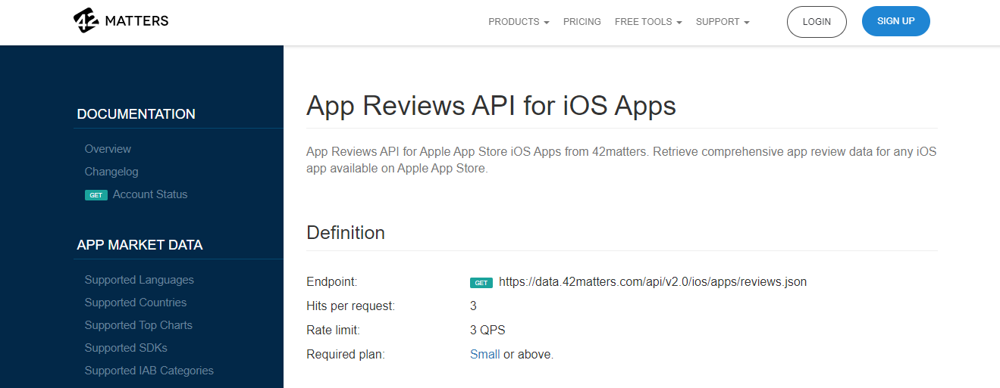

# Amazon Comprehend Project

## Retrieving API Data
### Getting API and Access Token
**42matters** provides App Reviews API for Apple App Store iOS Apps. We can get information such as dates, ratings of the app, and review contents. From [here](https://42matters.com/docs/app-market-data/ios/apps/reviews), you can sign up for free and get an access token on a 14-day trial. 

#### API key and `getpass`
Below, we are using a python package called getpass. On the first line of the code cell below, `import getpass` will load all of the functions that are available in the getpass package into memory on our notebook's machine. 

Then, we use the function `getpass()` by referring to where it is located with `getpass.getpass()` and storing the output of that function in a variable we are calling `APIKEY`.

import getpass
APIKEY = getpass.getpass()
